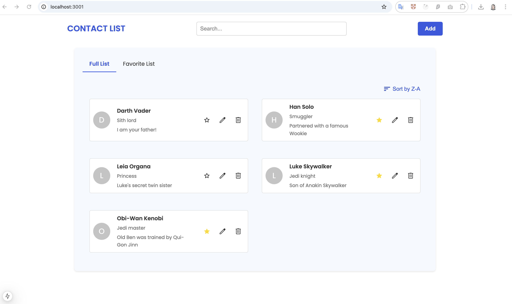

# 📇 Contact List Application

A simple and user-friendly contact management application that allows users to view, search, add, edit, delete, and mark contacts as favorites.



---

## 🚀 Features

- **View Contacts**: Browse a list of all saved contacts.
- **Search Contacts**: Filter contacts by first or last name.
- **Favorites**: Add or remove contacts from favorites.
- **Add & Edit Contacts**: Manage contact details through intuitive forms.
- **Delete Contacts**: Easily remove contacts from the list.
- **Responsive Design**: Optimized for both desktop and mobile views.

---

## 🛠️ Tech Stack

- **React**: For building dynamic UIs.
- **TypeScript**: Ensures type safety.
- **React Hook Form**: Manages form state and validation.
- **CSS Modules**: Scoped styling for modular CSS.
- **Jest & React Testing Library**: Test-driven component validation.

---

## 🧩 Installation

To get this project up and running locally, follow these steps:

1. **Clone the repository**:
   ```bash
   git clone https://github.com/tnbngoc912/contact-list

2. **Navigate to the project directory**:
  cd contact-list-app

3. **Install dependencies**:
  npm install

4. **Start the development server**:
  npm start

5. **Open the app**:
  Visit http://localhost:3000 (http://localhost:3001 if you run with repo taroko_server before) in your browser to see the application in action.

---

## 📖 Usage

Once the app is running, you can:

- **View Contacts**: See all your contacts in a single list.
- **Add New Contacts**: Use the **Add Contact** button to input new contact details.
- **Edit Contacts**: Update contact information with the **Edit** button.
- **Mark Favorites**: Click the star icon to add contacts to your favorites.
- **Delete Contacts**: Remove a contact with the **Delete** button.
- **Search Contacts**: Quickly filter through contacts by typing in the search bar.

---

## 📖 Running test
To run tests for the project:
npm test